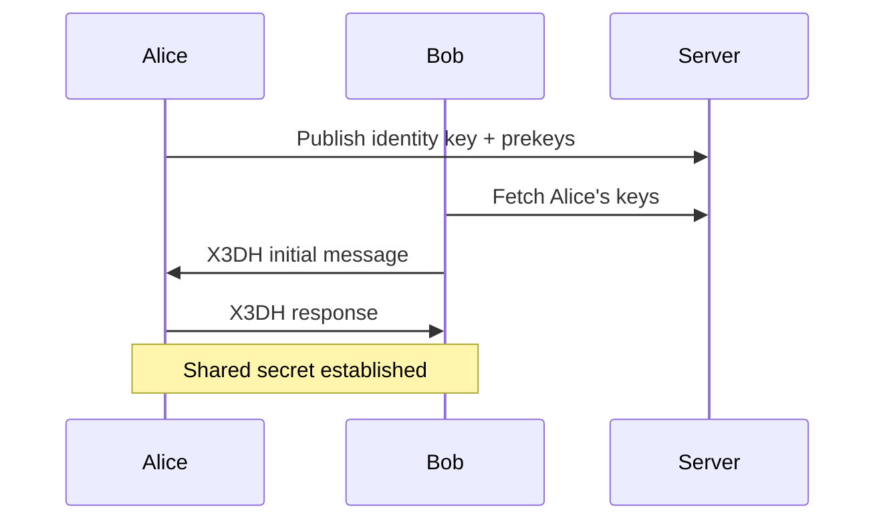
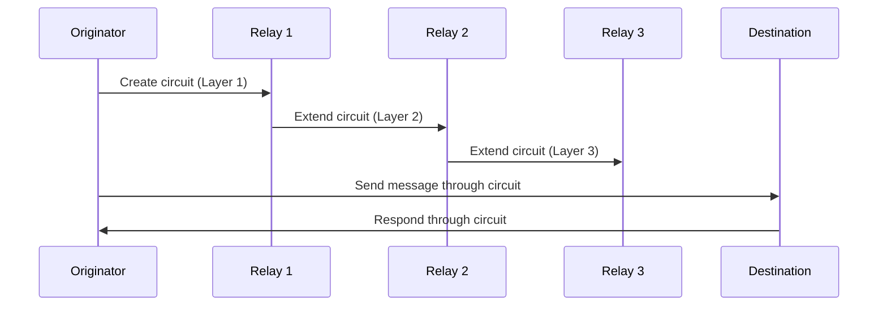

# Protocol Specification and Wire Format

This document defines the complete protocol specification for Privatus-chat, including message formats, wire protocols, state machines, and interoperability requirements.

## Overview

Privatus-chat implements multiple interoperating protocols for peer-to-peer communication, distributed hash table operations, and anonymity-preserving message routing. This specification defines the wire formats, message structures, and protocol state machines.

## Core Protocol Stack

### Protocol Layers
```
Application Layer (Chat, Files, Voice)
Transport Layer (Onion Routing, DTLS)
Network Layer (P2P, DHT, STUN/TURN)
Physical Layer (UDP, TCP, WebRTC)
```

## Message Protocol Specification

### Message Header Format

#### Binary Header Structure
```c
struct MessageHeader {
    uint16_t version;        // Protocol version (1)
    uint16_t message_type;   // Message type enum
    uint32_t message_id;     // Unique message identifier
    uint8_t sender_id[32];   // Sender node ID (32 bytes)
    uint8_t recipient_id[32]; // Recipient node ID (32 bytes)
    uint32_t timestamp;      // Unix timestamp
    uint32_t flags;          // Message flags
    uint16_t payload_length; // Length of encrypted payload
};
```

#### Message Flags
- **Bit 0 (0x01)**: Encrypted message
- **Bit 1 (0x02)**: Compressed payload
- **Bit 2 (0x04)**: Requires acknowledgment
- **Bit 3 (0x08)**: High priority message
- **Bit 4 (0x10)**: Group message
- **Bit 5 (0x20)**: Cryptographically signed

### Message Types Enumeration

#### Connection Management (0x0000-0x00FF)
- **HANDSHAKE (0x0001)**: Initial connection establishment
- **HANDSHAKE_ACK (0x0002)**: Acknowledge handshake
- **PING (0x0003)**: Connection liveness check
- **PONG (0x0004)**: Respond to ping
- **DISCONNECT (0x0005)**: Graceful connection termination

#### Chat Messages (0x0100-0x01FF)
- **CHAT_MESSAGE (0x0101)**: Direct chat message
- **MESSAGE_ACK (0x0102)**: Acknowledge message receipt
- **TYPING_INDICATOR (0x0103)**: User typing notification
- **MESSAGE_STATUS (0x0104)**: Message delivery status

#### File Transfer (0x0200-0x02FF)
- **FILE_OFFER (0x0201)**: Offer file for transfer
- **FILE_ACCEPT (0x0202)**: Accept file transfer
- **FILE_REJECT (0x0203)**: Reject file transfer
- **FILE_CHUNK (0x0204)**: File data chunk
- **FILE_COMPLETE (0x0205)**: File transfer completion

#### Group Chat (0x0300-0x03FF)
- **GROUP_INVITE (0x0301)**: Invite user to group
- **GROUP_JOIN (0x0302)**: Join group request
- **GROUP_LEAVE (0x0303)**: Leave group
- **GROUP_MESSAGE (0x0304)**: Group chat message
- **GROUP_INFO (0x0305)**: Group information update

#### Peer Discovery (0x0400-0x04FF)
- **PEER_DISCOVERY (0x0401)**: Discover peers in area
- **PEER_LIST (0x0402)**: Respond with peer list
- **PEER_ANNOUNCEMENT (0x0403)**: Announce peer presence

#### Error Handling (0xFF00-0xFFFF)
- **ERROR (0xFF01)**: Protocol or application error
- **AUTH_ERROR (0xFF02)**: Authentication failure
- **PERM_ERROR (0xFF03)**: Permission denied

## Wire Format Specifications

### UDP Transport Format
```
+--------+-----------------+------------------+
| Length | Message Header  | Encrypted Payload |
| (4)    | (28 bytes)      | (variable)       |
+--------+-----------------+------------------+
```

### TCP Transport Format
```
+--------+-----------------+------------------+
| Length | Message Header  | Encrypted Payload |
| (4)    | (28 bytes)      | (variable)       |
+--------+-----------------+------------------+
```

### WebRTC Data Channel Format
```
+--------+-----------------+------------------+
| Length | Message Header  | Encrypted Payload |
| (2)    | (28 bytes)      | (variable)       |
+--------+-----------------+------------------+
```

## Protocol State Machines

### Connection State Machine
```
DISCONNECTED → HANDSHAKE_SENT → HANDSHAKE_ACK_RECEIVED →
CONNECTED → DISCONNECT_SENT → DISCONNECTED
     ↓              ↓                    ↓
   ERROR          ERROR                ERROR
```

### Message Delivery State Machine
```
QUEUED → SENT → ACK_RECEIVED → DELIVERED
   ↓       ↓         ↓             ↓
 ERROR   ERROR     RETRY        CONFIRMED
```

### File Transfer State Machine
```
OFFER_SENT → OFFER_ACK → CHUNK_SENT → CHUNK_ACK →
COMPLETE_SENT → COMPLETE_ACK → TRANSFER_COMPLETE
     ↓             ↓           ↓           ↓
   ERROR         ERROR       ERROR       ERROR
```

## Cryptographic Protocols

### Handshake Protocol

#### X3DH Key Exchange


#### Double Ratchet Setup
```
Initial Key Exchange → Root Chain → Message Chains →
Forward Secrecy → Key Rotation → Continuous Protection
```

### Onion Routing Protocol

#### Circuit Construction


#### Circuit Layer Encryption
```
Message → Encrypt(Layer3) → Encrypt(Layer2) → Encrypt(Layer1) → Network
```

## DHT Protocol Specification

### Kademlia Message Format
```c
struct DHTMessage {
    uint8_t version;           // DHT protocol version
    uint8_t message_type;      // DHT message type
    uint32_t request_id;       // Unique request identifier
    uint8_t node_id[20];       // Sender node ID (160 bits)
    uint32_t payload_length;   // Payload length
    uint8_t payload[];         // Message payload
};
```

### DHT Message Types
- **PING (0x01)**: Node liveness verification
- **PONG (0x02)**: Respond to ping
- **FIND_NODE (0x03)**: Find nodes near target ID
- **FOUND_NODES (0x04)**: Respond with found nodes
- **FIND_VALUE (0x05)**: Find value for key
- **FOUND_VALUE (0x06)**: Respond with found value
- **STORE (0x07)**: Store key-value pair

### Node ID Format
- **Length**: 160 bits (20 bytes)
- **Generation**: SHA-1 hash of random data
- **Representation**: Hexadecimal encoding for display

## STUN/TURN Protocol Implementation

### STUN Message Format
```c
struct STUNMessage {
    uint16_t message_type;     // STUN message type
    uint16_t message_length;   // Message length
    uint32_t magic_cookie;     // STUN magic cookie (0x2112A442)
    uint8_t transaction_id[12]; // Unique transaction ID
    uint8_t attributes[];      // STUN attributes
};
```

### STUN Attributes
- **MAPPED_ADDRESS (0x0001)**: Reflexive transport address
- **XOR_MAPPED_ADDRESS (0x0020)**: XOR-mapped transport address
- **ERROR_CODE (0x0009)**: Error response
- **UNKNOWN_ATTRIBUTES (0x000A)**: Unknown attribute handling

## Serialization Formats

### JSON Message Format
```json
{
  "header": {
    "version": 1,
    "message_type": "chat_message",
    "message_id": "550e8400-e29b-41d4-a716-446655440000",
    "sender_id": "a1b2c3d4e5f67890123456789012345678901234567890123456789012",
    "recipient_id": "12345678901234567890123456789012345678901234567890123456789012",
    "timestamp": 1640995200,
    "flags": 5
  },
  "payload": {
    "content": "Hello, World!",
    "timestamp": 1640995200
  },
  "signature": "3045022100abcd..."
}
```

### Binary Serialization
- **Length Prefix**: 4-byte big-endian length
- **Header**: Fixed 28-byte structure
- **Payload**: Variable length encrypted data
- **Compression**: Optional zlib compression

## Protocol Extensions

### Version Negotiation
```
Client → Server: Version 1.0 supported
Server → Client: Version 1.0 accepted
```

### Feature Capabilities
- **Chat**: Basic messaging capabilities
- **File Transfer**: Large file exchange
- **Voice**: Real-time voice communication
- **Group Chat**: Multi-party messaging
- **Anonymity**: Onion routing support

### Extension Points
- **Custom Message Types**: Application-defined message types
- **Plugin Protocols**: Third-party protocol extensions
- **Experimental Features**: Beta feature support

## Error Handling

### Error Response Format
```json
{
  "error_code": "INVALID_MESSAGE",
  "error_message": "Message format is invalid",
  "original_message_id": "550e8400-e29b-41d4-a716-446655440000",
  "timestamp": 1640995200
}
```

### Error Codes
- **INVALID_MESSAGE (0x0001)**: Malformed message
- **AUTHENTICATION_FAILED (0x0002)**: Authentication failure
- **PERMISSION_DENIED (0x0003)**: Insufficient permissions
- **UNSUPPORTED_VERSION (0x0004)**: Protocol version mismatch
- **RESOURCE_EXHAUSTED (0x0005)**: Server overload

## Interoperability

### Standards Compliance
- **RFC 5389**: STUN protocol implementation
- **RFC 5766**: TURN protocol implementation
- **RFC 5245**: ICE connectivity establishment
- **Kademlia DHT**: Distributed hash table protocol

### Cross-Platform Support
- **Endianness**: Big-endian network byte order
- **Character Encoding**: UTF-8 for text data
- **Timestamp Format**: Unix timestamp (seconds since epoch)
- **Node ID Format**: 160-bit binary identifiers

## Security Considerations

### Protocol Security
- **Encryption Requirements**: All messages must be encrypted
- **Authentication**: Cryptographic peer authentication
- **Integrity Protection**: Message integrity verification
- **Replay Protection**: Unique message IDs and timestamps

### Wire Format Security
- **Length Validation**: Prevent buffer overflow attacks
- **Format Validation**: Strict message format checking
- **Signature Verification**: Cryptographic signature validation
- **Padding Oracle Protection**: Secure padding implementation

## Testing and Validation

### Protocol Conformance Testing
- **Message Format Validation**: Ensure correct serialization
- **State Machine Testing**: Verify protocol state transitions
- **Interoperability Testing**: Cross-implementation compatibility
- **Performance Testing**: Protocol overhead measurement

### Security Testing
- **Fuzzing**: Random input testing for robustness
- **Penetration Testing**: Attack resistance validation
- **Cryptographic Testing**: Algorithm implementation verification
- **Traffic Analysis**: Anonymity preservation testing

## Implementation Guidelines

### Message Processing
1. **Length Validation**: Check message length before processing
2. **Format Parsing**: Validate message structure
3. **Signature Verification**: Authenticate message origin
4. **Decryption**: Decrypt message payload
5. **Handler Dispatch**: Route to appropriate handler

### Error Handling
1. **Graceful Degradation**: Continue operation after errors
2. **Resource Cleanup**: Free resources on error
3. **User Notification**: Inform user of protocol errors
4. **Logging**: Record protocol events for debugging

## Future Protocol Evolution

### Version 2.0 Considerations
- **Post-Quantum Cryptography**: Quantum-resistant algorithms
- **Enhanced Anonymity**: Next-generation onion routing
- **Performance Optimization**: Reduced protocol overhead
- **Mobile Optimization**: Bandwidth and battery efficiency

### Extension Framework
- **Plugin Architecture**: Third-party protocol extensions
- **Feature Flags**: Enable/disable protocol features
- **Backward Compatibility**: Support for older versions
- **Migration Support**: Seamless version upgrades

## Reference Implementation

### Message Serialization Example
```python
def serialize_message(message: P2PMessage) -> bytes:
    # Convert to dictionary
    data = message.to_dict()

    # JSON serialization
    json_data = json.dumps(data).encode('utf-8')

    # Compression if needed
    if len(json_data) > COMPRESSION_THRESHOLD:
        json_data = zlib.compress(json_data)
        message.header.flags |= MessageFlags.COMPRESSED

    # Length prefix
    length = len(json_data)
    packet = struct.pack('!I', length) + json_data

    return packet
```

### Message Deserialization Example
```python
def deserialize_message(data: bytes) -> P2PMessage:
    # Read length prefix
    length = struct.unpack('!I', data[:4])[0]

    # Extract message data
    json_data = data[4:4+length]

    # Decompression if needed
    if message.header.flags & MessageFlags.COMPRESSED:
        json_data = zlib.decompress(json_data)

    # Parse JSON
    message_dict = json.loads(json_data.decode('utf-8'))

    # Create message object
    return P2PMessage.from_dict(message_dict)
```

## Conclusion

This protocol specification provides a complete definition of Privatus-chat's communication protocols, ensuring interoperability, security, and maintainability. The specification covers message formats, wire protocols, state machines, and security requirements for all system components.

The protocol design emphasizes security, performance, and extensibility while maintaining backward compatibility and standards compliance. Regular updates and community involvement help ensure the protocol evolves to meet emerging requirements and security challenges.

---

*Last updated: January 2025*
*Version: 1.0.0*